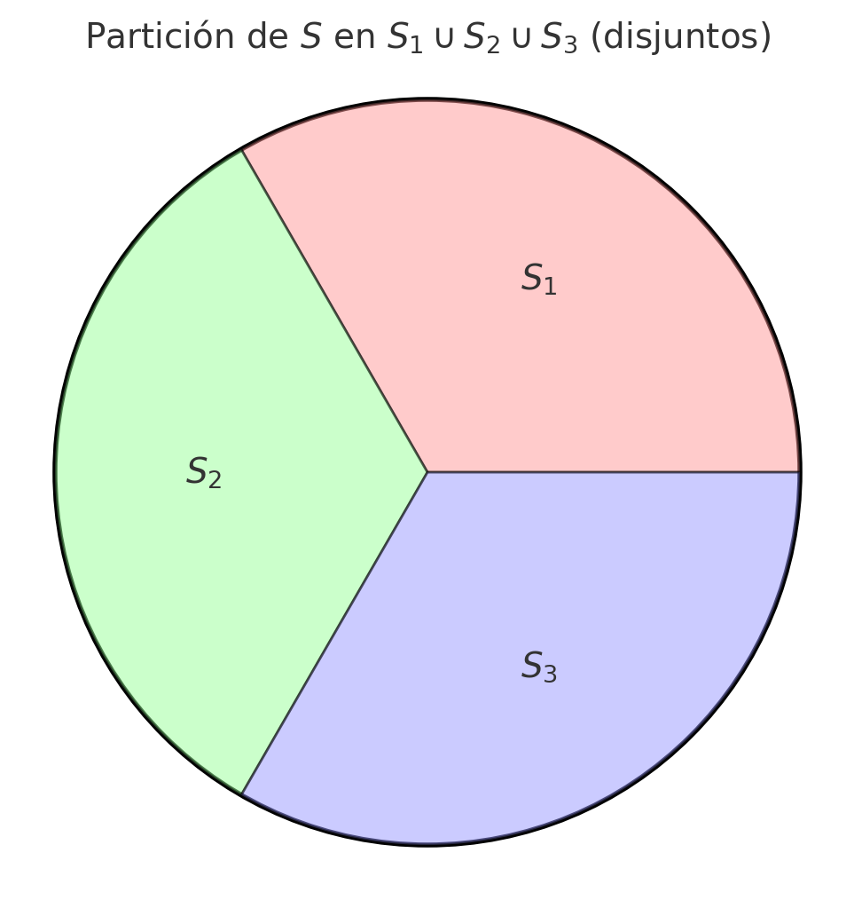

# Principio Aditivo

## Mirémoslo como elementos de conjuntos

Vamos a decir que tenemos el conjunto llmado $S$, y que es el conjunto que tiene todos los elementos de la solución que estoy buscando.

> Si estoy buscando saber cuántos son los elementos de $S$ (porque estoy contando), a esto lo llamamos: el cardinal de $S$ y se escribe asi: $|S|$

> Por ejemplo, si digo $|S| = 5$ estoy diciendo que la cantidad de elementos del conjunto $S$ es de 5 elementos.

Puedo decir que el conjunto $S$ se compone de muchos subconjuntos de $S$. Es decir que tengo muchos (sub)conjuntitos que llamaremos $S_i$, que si los juntamos todos forman $S$ en su totalidad.

Lo escribimos asi:
$
S = S_1 \cup S_2 \cup S_3 \cup ... \cup S_m
$

### Pero pero pero pero

Se debe tener cuidado de **cumplir con una condición muy importante**. Y es que los subconjuntitos $S_i$ sean disjuntos entre sí.

> Que sean disjunto quiere decir, que si tenemos un $S$ compuesto por ejemplo, solamente por un $S_1$ y un $S_2$. Si revisamos a $S_1$ ninguno de sus elementos se encuentra compartido con $S_2$ o dentro de $S_2$.

>Que dos conjuntos o subconjuntos sean disjuntos quiere decir que no tienen intersección, o que su intersección es nula. Y se escribe asi $ S_1 \cap S_2 = \emptyset $

Pero **SIEMPRE** tengo que buscar que esos subconjuntos sean disjuntos entre si.

> Cuando tengo **subconjuntos disjuntos entre si** que forman un conjunto $S$. A esta combinación de elementos que pertenecen a estos subconjuntos, que conforman todo el conjunto $S$ lo llamamos _una partición de $S$_

## Regresemos al principio Aditivo

Entonces, estas contando cosas que te pidieron en esta materia. Pero por algún motivo no podés encontrar a todos esos elementos juntos.

Entonces, decis voy a contarlos por partes, o por casos, o por escenarios.

### En esta situación lo que hacés para ser ininputable es decir:

Sea $S$ el conjunto que contiene todas las soluciones de mi problema o todos los elementos que quiero contar.

Si $S$ contiene todas las soluciones, entonces $|S|$ es la cantidad de esos elementos (la respuesta a lo que me piden).

Y analizas los diferentes, casos, partes o escenarios. Diciendo que cada caso es un subconjunto de $S$. Y por lo tanto la totalidad de los casos, partes o escenarios es todo el conjunto $S$. (Siempre que hayas contado bien todo los casos, partes y escenarios que conforman $S$)

Entonces, la unión de todos los casos da tu $S$. A cada caso lo consideramos un $S_i$ y le vas asignando un valor a su $i$.

$ S = S_1 \cup S_2 \cup S_3 $

Pero es importante que puedas justificar y explicar que
$ S_1 \cap S_2 = \emptyset\space \space \space \And \space \space \space S_2 \cap S_3 = \emptyset\space \space \space \And \space \space \space S_1 \cap S_3 = \emptyset$

> Cuando tenés muchos $S_i$ se escribe algo asi como

> $S_i\cap S_j = \emptyset\space \forall j,i / j\not ={i}$

> Se lee "La intersección entre $S_j$ y $S_i$ es nula PARA TODO 'j' e 'i' (de los que forman el conjunto S), y siempre que j no sea igual que i.

> Y se entiende que "Para cualquier par de subconjuntos (es decir para todo par de subconjunto) que forman al conjunto S, la intersección de estos dos subconjuntos es vacía". Agarrá dos subconjuntitos que forman al S, y no tienen elementos en común o que compartan. Asi, siempre.

## Entonces...

Cuando lograste justificar estas dos condiciones. Que los subconjuntos forman al conjunto grande, y que los subconjuntos, agarrados entre si, dos a dos, nunca tienen partes repetidas...

**Felicitaciones**

Formaste una partición de S. Y entonces podés decir lo siguiente:

$
|S| = |S_1| + |S_2| + |S_3| + ... + |S_m|
$

## Una boludez

El número de elementos de S es igual a la suma de la cantidad de elementos de cada subconjunto